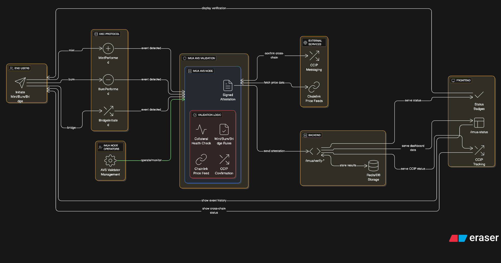

# DSC Protocol × Imua AVS Integration Architecture

## Overview

This document outlines the detailed architecture for the integration of **DSC Protocol** with **Imua Actively Validated Services (AVS)**. It explains how on-chain stablecoin actions (minting, burning, bridging) in the DSC ecosystem are validated in real time by Imua's decentralized validator nodes using cryptographic attestations and Chainlink services.

---

## 🔧 Core Components

### 1. **DSC Protocol**

The DSC Protocol allows end-users to:

* Mint DSC (USD-pegged stablecoin)
* Burn DSC
* Bridge DSC across chains

Each user action emits an **on-chain event**, which is picked up by the AVS validation system.

**Relevant Events:**

* `MintPerformed`
* `BurnPerformed`
* `BridgeInitiated`

---

### 2. **Imua AVS Validation System**

The AVS module continuously watches for DSC events. Once an event is detected:

#### a. **AVS Node**

* Listens for on-chain events (mint/burn/bridge)
* Triggers validation logic
* Issues a **Signed Attestation** if the action passes all checks

#### b. **Validation Logic**

Validation checks include:

* **Collateral Health Check** (price/risk ratio, token validity)
* **Rule Enforcement** for minting, burning, and bridging
* **CCIP Message Confirmation** (for bridge actions)
* **Chainlink Price Feed Fetch** (real-time token pricing)

#### c. **Operator Management**

* Validators run Imua AVS nodes
* Stake to participate
* Submit/validate tasks to maintain protocol integrity

---

### 3. **External Services**

#### a. **Chainlink Price Feeds**

Used to:

* Validate collateral value during minting
* Perform health checks during liquidation/withdraw

#### b. **Chainlink CCIP Messaging**

* Confirms bridge action across chains
* Ensures proper mint/burn logic is executed on both ends

---

### 4. **Backend Services**

* Receives signed attestations from Imua nodes
* Validates and stores them in Redis/DB
* Provides public API endpoints like `/imua/verify-*`
* Enables observability and backend logic

**Endpoints:**

* `/imua/verify-mint`
* `/imua/verify-burn`
* `/imua/verify-bridge`

---

### 5. **Frontend Interface**

Visualizes the state of AVS and validation outcomes to users and developers:

* `/imua-status` – Shows current health and validator participation
* Status Badges – Verified, In-Progress, Failed, etc.
* CCIP Status – Shows bridge confirmations
* Task Dashboard – Operator and AVS task stats

---

## 🔄 Data Flow Summary

1. **User Action:** Initiates a mint, burn, or bridge transaction via the DSC frontend or AI interface.
2. **Event Detection:** Smart contracts emit an event (e.g., `MintPerformed`).
3. **AVS Trigger:** Imua AVS node detects the event and starts validation.
4. **Validation Logic:** Checks collateral, pricing, CCIP message (if required).
5. **Attestation:** If valid, a signed attestation is emitted.
6. **Backend Update:** Backend API stores attestation and exposes its result.
7. **Frontend Display:** Shows attestation outcome and validator status to the user.

---

## 🛠 Configuration Notes

**AVS Configuration (`config.yaml`) Includes:**

* `AVSOwnerAddress`
* `OperatorAddress`
* `EthRpcUrl`, `EthWsUrl`
* Paths to BLS/ECDSA keys
* `MinStakeAmount`, `AvsRewardProportion`, etc.
* Task intervals and response periods

AVS is deployed if not already set, and `SignedAttestation` is used to confirm state integrity.

---

## 🚀 Benefits of Integration

* **Real-time event attestation** on-chain
* **Validator-based trust** (not single-point)
* **Chainlink integration** ensures pricing + bridging are cryptographically verified
* **AI-friendly structure** allows event display via Chat or Voice apps
* **Fully composable** with the rest of DSC architecture

---

## 📊 Future Improvements

* Add light clients for mobile attestation viewing
* Integrate AVS staking dashboard
* Expand validation logic with zkProofs
* Reward validators using `AVSRewardAddress` proportionally

---

## 📂 Repo Structure (Partial)

```
hello-world-avs/
├── avs/                    # AVS validator logic
│   └── cmd/main.go
├── operator/               # Operator management CLI
│   └── cmd/main.go
├── tests/keys/             # BLS and ECDSA key stores
├── config.yaml             # Main configuration file
├── avsbinary               # Compiled AVS executable
├── operatorbinary          # Compiled Operator executable
```

---

## 🧠 Contact

For contributions or questions, please reach out to the DSC Protocol team or Imua AVS maintainers.

> **DSC Protocol × Imua Ignite – Secure, Transparent, Composable**
